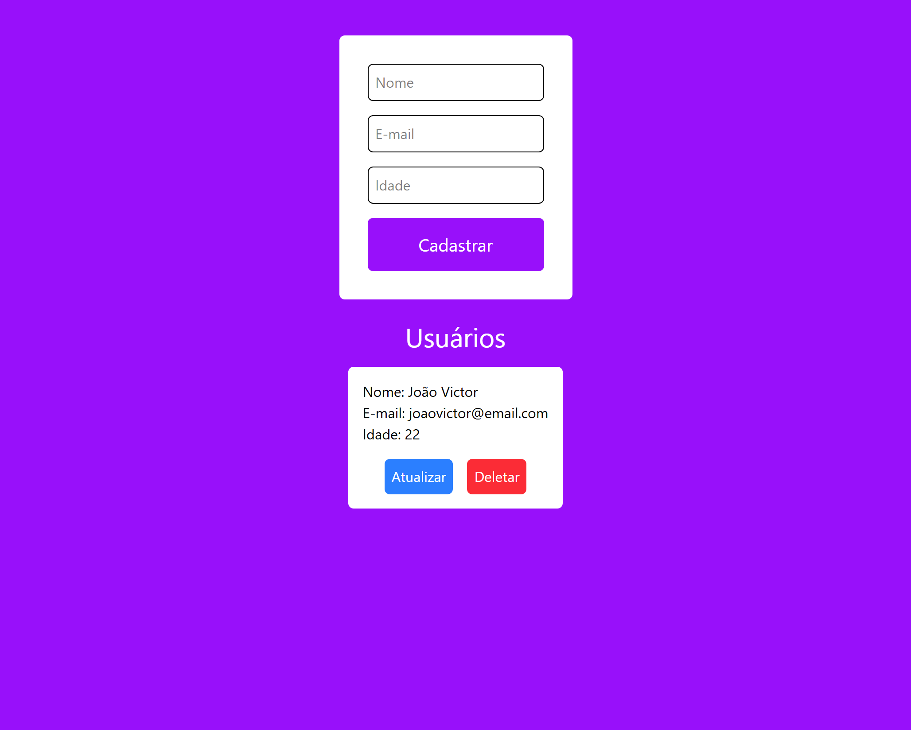

# 🚀 Sistema de Usuários - Front-End



Aplicação front-end desenvolvida com React para gerenciamento de usuários, consumindo uma API REST.

Este projeto permite criar, listar, editar e deletar usuários de forma simples e intuitiva, com validação de formulários.

## 🧠 Tecnologias utilizadas

- React
- Vite
- JavaScript
- Tailwind CSS
- React Hook Form
- Yup

## 📌 Funcionalidades

* ✅ Cadastro de usuários
* 📄 Listagem de usuários
* ✏️ Edição de usuários
* ❌ Remoção de usuários
* ⚠️ Validação de formulário com Yup
* 🔄 Integração com API REST

## 🔗 Integração com API

Este projeto consome a API desenvolvida em Node.js:

👉 https://github.com/goncalvesjv2/api-usuarios-node

## ⚙️ Como rodar o projeto

### 1. Clonar o repositório

```bash
git clone https://github.com/goncalvesjv2/usuarios-web.git
```

### 2. Entrar na pasta

```bash
cd usuarios-web
```

### 3. Instalar dependências

```bash
npm install
```

### 4. Rodar o projeto

```bash
npm run dev
```

## 🚀 Próximas melhorias

- Deploy 
